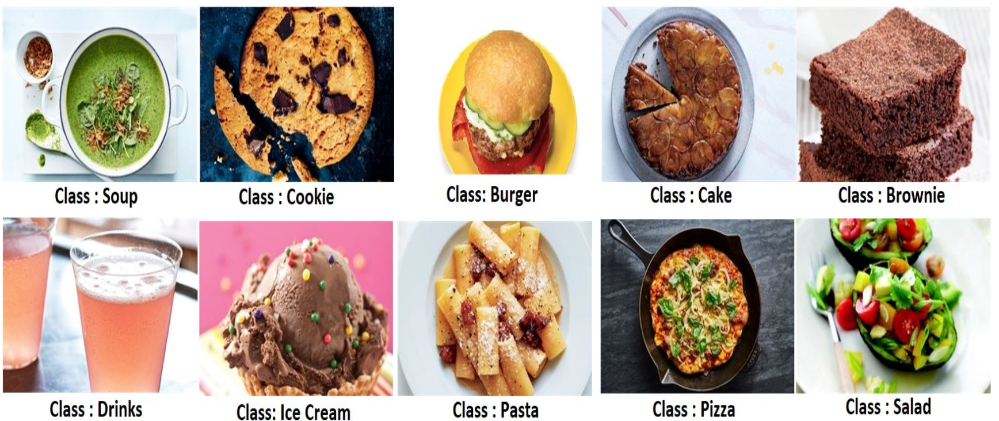
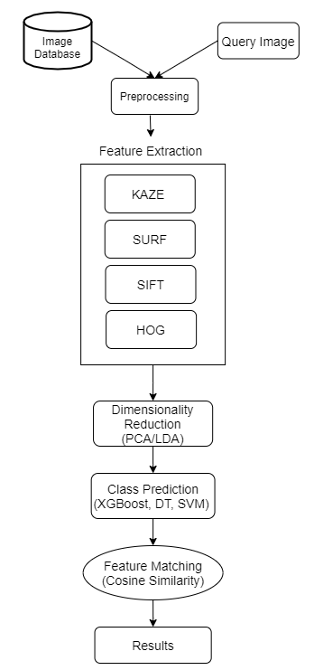
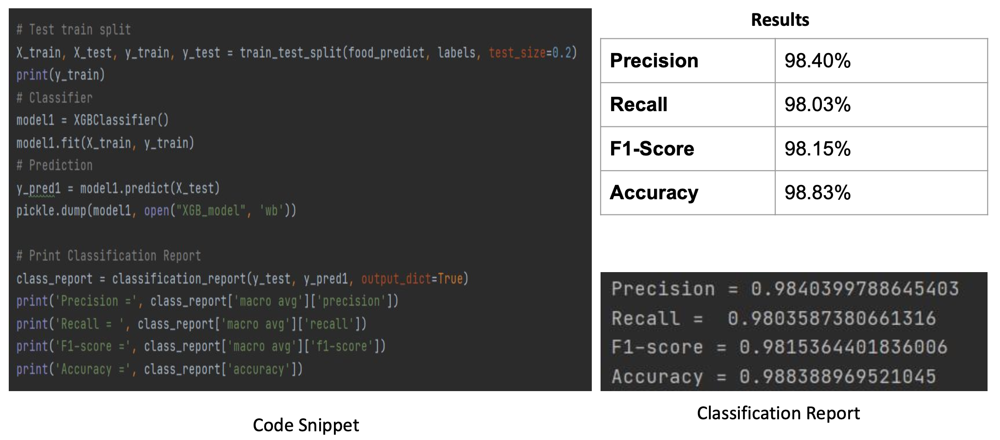
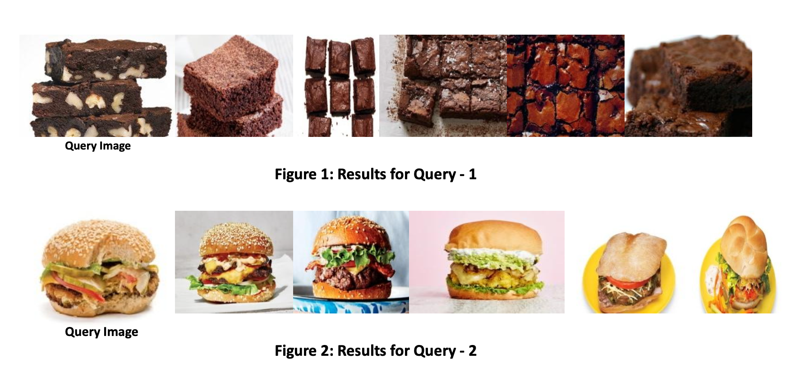
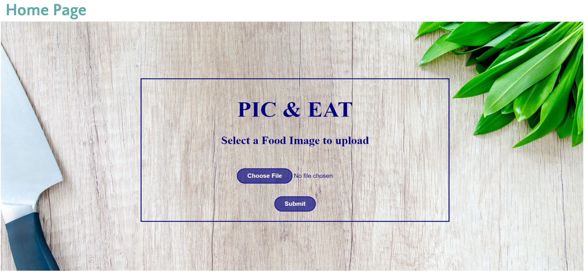

## Image Based Recipe Recommendation System

## Project Overview

This project is done as a part of `Computational Gastronomy` Course for my MTech CSE degree. Project's aim is- “Extracting similar images and recipes to an input image of a food item”.
  

&nbsp;

Project Presentation can be found at [Project-Presentation.pdf](MC-Poster-midterm.pdf).

## Dataset Used
Food Ingredients and Recipes Dataset with Images which has been scraped from website named Epicurious and consists of 15
folders representing various dishes and contains 3445 images. It also has a csv file which has 5 columns namely:
❖ Title: Represents the Title of the Food Dish.
❖ Ingredients: Contains the ingredients as they were scraped from the website.
❖ Instructions: Has the recipe instructions to be followed to recreate the dish.
❖ Image_Name: Has the name of the image as stored in the Food Images zipped
folder.
❖ Cleaned_Ingredients: Contains the ingredients after being processed and
cleaned.

## Dataset Visualization
                                   Fig 1. Dataset Visualization 

The aim of this project is to recommend recipes based on a query image of a dish that is provided as an input. This project involves following modules:
1. **Data Preprocessing** :  All the images in the food image database and the query image is reshaped to the size 224*169*3. 
2. **Feature Extraction** : Features are extracted using feature extraction techniques like KAZE, SIFT, SURF and HOG.
3. **Ensembling Features** : Here, all Features obtained from above feature extraction techniques are combined/stacked.
4. **Feature matching** : Ffeature matching is performed between the query image and the images of the predicted class using cosine similarity.
5. **Class Prediction** : Various classifiers are used to predict which class the query image belongs to.
7. **Image and Recipe Retrieval** : First 5 images and their recipes are retrieved based on the least distances or maximum similarities.
8. **UI** : These dishes and their recipes are displayed in a website using HTML and server is hosted using Flask.
 
                                   Fig 2. Modules

## Model Performance
                                   Fig 3. Model Performance 

## Sample Results
                                   Fig 4. Results

## Website Glimpse
                                   Fig 5. Home Page

                                   Fig 6. Query Results

## Project Team Members
 
1. Shradha Sabhlok  
2. Akhil Mahajan
3. Nitish Jha

